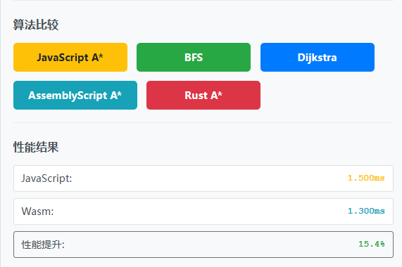
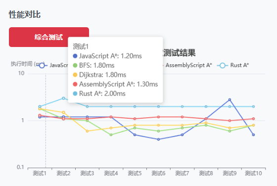

# 寻路算法项目 (Pathfinding Algorithms)

## 简介
一个基于 TypeScript/JavaScript、AssemblyScript和rust实现的寻路算法演示项目，包含多种经典寻路算法的实现和可视化演示。
- [代码仓库](https://github.com/wangyh8456/findPath)

## 项目介绍
顶部有一个矩形，第一次点击矩形的单元格会设置绿色的起点，再次点击会设置红色的终点，接下来的每次点击都会把单元格设置为障碍，或设置障碍单元格为通路，每个单元格可以向八个方向移动。初始化矩形时，会根据设置的初始障碍物密度（0-1）生成一些障碍。

设置好之后，可以点击下方操作区中“算法比较”一栏的按钮调用算法。上方的三个算法是ts写的bfs、dijkstra和a-star算法，调用任何一个方法都会在下方“性能结果”一栏的JavaScript区域显示调用时间。下方的两个按钮分别使用assemblyscript和rust写的a-star算法，调用后会显示调用时间在Wasm中。


最下方的“综合测试”按钮点击后会调用5个算法十次，把结果生成为一个图表。


## 算法介绍

### 🧮 A* 算法核心公式

### f = g + h

A* 算法的核心是评估函数 `f(n) = g(n) + h(n)`，其中：

- **f(n)**: 节点 n 的总评估值
- **g(n)**: 从起点到节点 n 的实际代价
- **h(n)**: 从节点 n 到终点的启发式估计代价

### 各部分详解

#### G 值 (实际代价)
- 表示从起点到当前节点的**实际最短距离**
- 在网格中，直线移动代价为 1，对角线移动代价为 √2 ≈ 1.414
- 计算方式：`g(新节点) = g(当前节点) + 移动代价`

#### H 值 (启发式函数)
启发式函数用于估计从当前节点到目标的距离，不同的启发式函数会影响算法的性能和结果：

**1. 欧几里得距离 (推荐)**
```typescript
h = Math.sqrt((x1 - x2)² + (y1 - y2)²)
```
- ✅ **可接受性**: 永远不会高估真实距离
- ✅ **最优性**: 保证找到最短路径
- ✅ **精确性**: 在连续空间中给出精确估计

**2. 曼哈顿距离 (不推荐用于8方向网格)**
```typescript
h = Math.abs(x1 - x2) + Math.abs(y1 - y2)
```
- ❌ **高估**: 在允许对角线移动的网格中会高估距离
- ❌ **次优解**: 违反可接受性条件，可能找不到最优路径
- ✅ **计算快**: 只需要加法运算

**3. 切比雪夫距离 (8方向网格的好选择)**
```typescript
h = Math.max(Math.abs(x1 - x2), Math.abs(y1 - y2))
```
- ✅ **可接受性**: 在8方向网格中不会高估
- ✅ **效率**: 计算比欧几里得距离更快
- ⚠️ **略保守**: 可能比欧几里得距离探索更多节点

**4. 欧几里得距离平方 (错误示例)**
```typescript
h = (x1 - x2)² + (y1 - y2)²  // 错误！
```
- ❌ **严重高估**: 违反可接受性条件
- ❌ **次优解**: 经常找不到最优路径
- ❌ **搜索偏向**: 导致算法选择错误的搜索方向

### 可接受性条件

启发式函数必须满足**可接受性条件**：`h(n) ≤ h*(n)`

其中 `h*(n)` 是从节点 n 到目标的真实最短距离。

- **可接受的启发式函数**: 保证 A* 找到最优解
- **不可接受的启发式函数**: 可能导致次优解，但搜索速度可能更快

## AssemblyScript 实现

### 项目框架搭建

1. 创建 Monorepo 结构

    推荐用 pnpm workspace 或 yarn workspaces。我用 pnpm 举例：

```
mkdir pathfinding
cd pathfinding
pnpm init -y
```

在根目录添加 pnpm-workspace.yaml：

```
packages:
    "packages/*"
    "apps/*"
```
2. 创建两个子项目

    （1）算法包：packages/a-star

```
mkdir -p packages/a-star
cd packages/a-star
pnpm init -y
```

#### 安装依赖：

```
pnpm add --save-dev assemblyscript tsup
pnpm dlx asinit .   # 初始化 AssemblyScript 工程
```

#### 在这里你会有：

```
packages/a-star/

  assembly/     # 存放 AssemblyScript 源码
  
  src/          # TypeScript 封装（负责加载 wasm）
  
  package.json
```

（2）演示应用：apps/demo

这是 React 应用，用来演示 A* 寻路效果，最终跑在浏览器。

```
mkdir -p apps/demo
cd apps/demo
pnpm create vite@latest . --template react-ts
```

安装依赖：

```
pnpm install
```

在 apps/demo/package.json 中，声明依赖你的算法包：

```
"dependencies": {
  "a-star": "workspace:*"
}
```

这样 React App 就能直接 import 你自己写的算法库。

3. 根目录配置

    在 wasm-pathfinding/package.json 里添加 workspace 配置：

```
{
  "name": "pathfinding",
  "private": true,
  "workspaces": [
    "packages/*",
    "apps/*"
  ]
}

```


4. 脚本规划

    在根目录 package.json 里加上统一的脚本：

```
{
  "scripts": {
    "build:lib": "pnpm --filter a-star build",
    "dev:demo": "pnpm --filter demo dev",
    "build:demo": "pnpm --filter demo build"
  }
}

```

这样你可以：

```
pnpm build:lib → 编译 AssemblyScript 算法库

pnpm dev:demo → 启动 React 开发服务器

pnpm build:demo → 构建 React 静态资源

```

5. 工程化工具配置

根目录就可以放统一的 lint/format 工具：

eslint + prettier

husky + lint-staged（可选，commit 时检查）

✅ 搭建完成后的目录结构

```
pathfinding/
├─ apps/
│  └─ demo/             # React + Vite 演示应用
├─ packages/
│  └─ a-star/        # AssemblyScript + TS 封装，未来要发 npm
├─ pnpm-workspace.yaml
├─ package.json         # workspace 配置

```

### 实现AssemblyScript

- 实现AssemblyScript部分的编写（详情查看[github](https://github.com/wangyh8456/findPath)仓库）
- 在a-star文件夹下运行
```
pnpm run asbuild
```
得到AssemblyScript打包产物
- 在app/demos/App.tsx中使用
```
import { findPathAstar as findPathAstarWasm } from 'a-star';

const result: Array<string> | null = findPathAstarWasm(
    boolGrid,
    startPoint.x,
    startPoint.y,
    endPoint.x,
    endPoint.y
);

```
## Rust 实现

### Windows 上安装 Rust 和 Cargo 的步骤

 1.下载 Rustup 安装程序

- 访问 https://rustup.rs/
- 点击 "Download rustup-init.exe" 下载安装程序

 2.运行安装程序

- 双击下载的 rustup-init.exe
- 按照提示选择安装选项（通常选择默认选项即可）
- 安装程序会自动下载并安装 Rust 和 Cargo

 3.验证安装

- 重新打开 PowerShell 或命令提示符
- 运行以下命令验证安装：
  rustc --version
  cargo --version

 4.安装完成后的配置

- 更新 PATH 环境变量

    Rustup 会自动添加 ~/.cargo/bin 到 PATH
    如果没有自动添加，手动添加该路径到系统 PATH

- 安装 wasm-pack（用于 WebAssembly 开发）

    cargo install wasm-pack

### Rust WebAssembly A* 算法项目开发步骤

1.配置 Cargo.toml

    打开项目根目录下的 Cargo.toml 文件
    添加以下内容：

    [package]
    name = "a-star-rust"
    version = "0.1.0"
    edition = "2021"

    [lib]
    crate-type = ["cdylib"]

    [dependencies]
    wasm-bindgen = {version="0.2",features = ["serde-serialize"]}
    js-sys = "0.3"
    web-sys = { version = "0.3", features = ["console"] }
    serde = { version = "1.0", features = ["derive"] }
    serde-wasm-bindgen = "0.4"


    # 优化 WebAssembly 输出大小
    [profile.release]
    opt-level = "s"
    lto = true

    [package.metadata.wasm-pack.profile.release]
    wasm-opt = false

2.实现 A* 算法核心代码

    创建 src/lib.rs 文件
    实现 A* 算法核心代码

3.构建 WebAssembly 模块

    运行以下命令构建 WebAssembly 模块：
    wasm-pack build --target web --out-dir pkg

4.在 packages/a-star-rust 目录下创建 package.json

    {
        "name": "a-star-rust",
        "version": "0.1.0",
        "description": "A* pathfinding algorithm implemented in Rust for WebAssembly",
        "main": "pkg/a_star_rust.js",
        "types": "pkg/a_star_rust.d.ts",
        "files": [
            "pkg"
        ],
        "scripts": {
            "build": "wasm-pack build --target web --out-dir pkg",
            "build:release": "wasm-pack build --target web --out-dir pkg --release"
        },
        "keywords": ["pathfinding", "astar", "rust", "webassembly"],
        "author": "",
        "license": "ISC"
    }

5.在根目录的 pnpm-workspace.yaml 中确保包含：

    packages:
    - 'packages/*'
    - 'apps/*'

6.在你的 App.tsx 或其他 TypeScript 文件中：
    
    import init, { find_path_astar } from 'a-star-rust';
    // 使用前必须初始化 WebAssembly 模块
    await init();

    // 使用 A* 算法
    const grid = [
    [true, true, false],
    [true, true, true],
    [false, true, true]
    ];

    const result = find_path_astar(grid, 0, 0, 2, 2);
    console.log('路径:', result.path);
    console.log('是否找到:', result.found);
    console.log('执行时间:', result.time, 'ms');

7.在 apps/demo/package.json 中添加：
 
    {
        "dependencies": {
            "a-star-rust": "workspace:*",
            // ... 其他依赖
        }
    }

8.测试

    //回到根目录，安装依赖
    cd ../..
    pnpm install

    // 启动 demo 应用
    pnpm dev:demo


